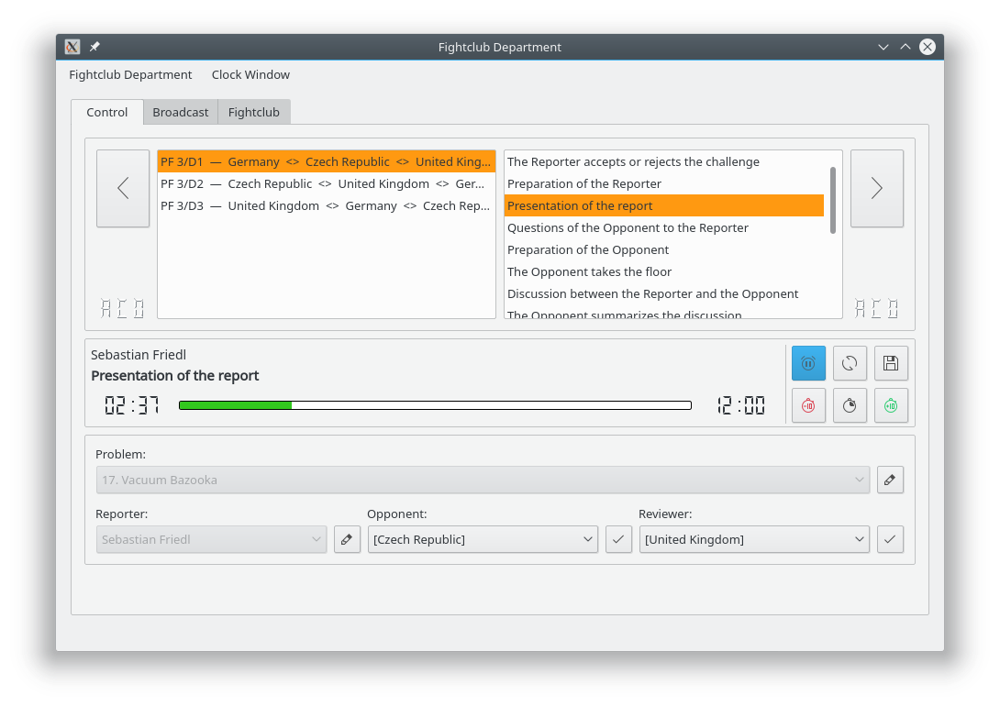
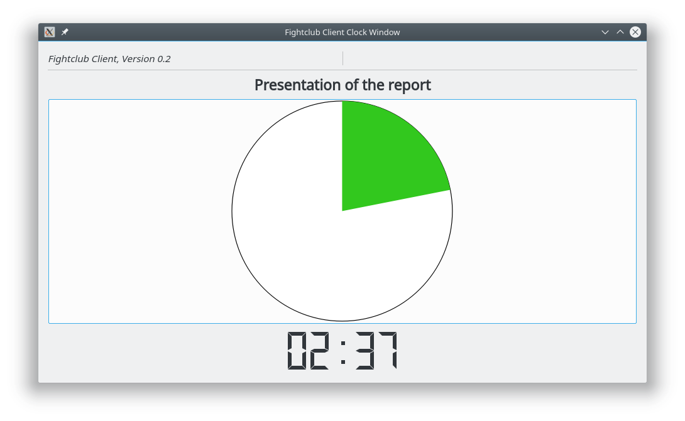
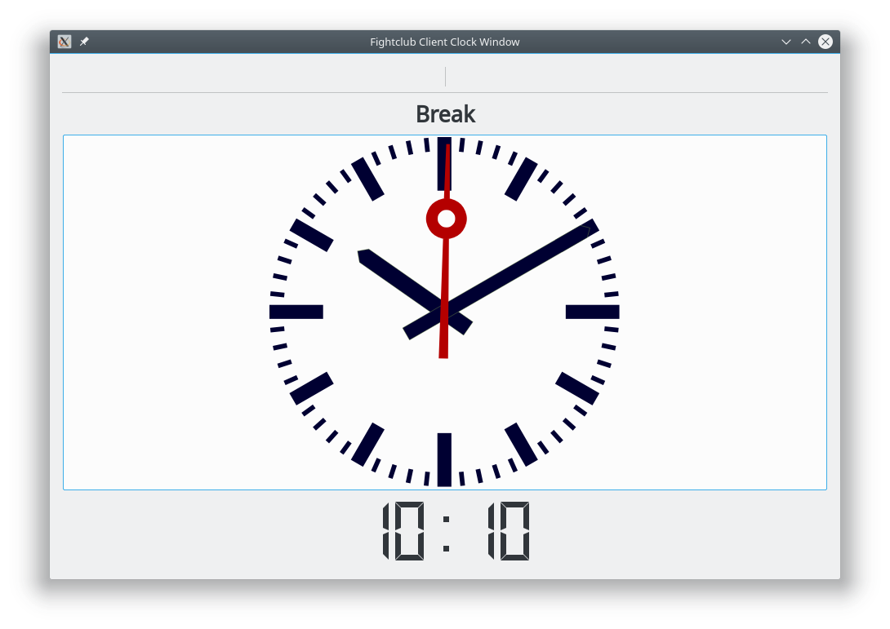
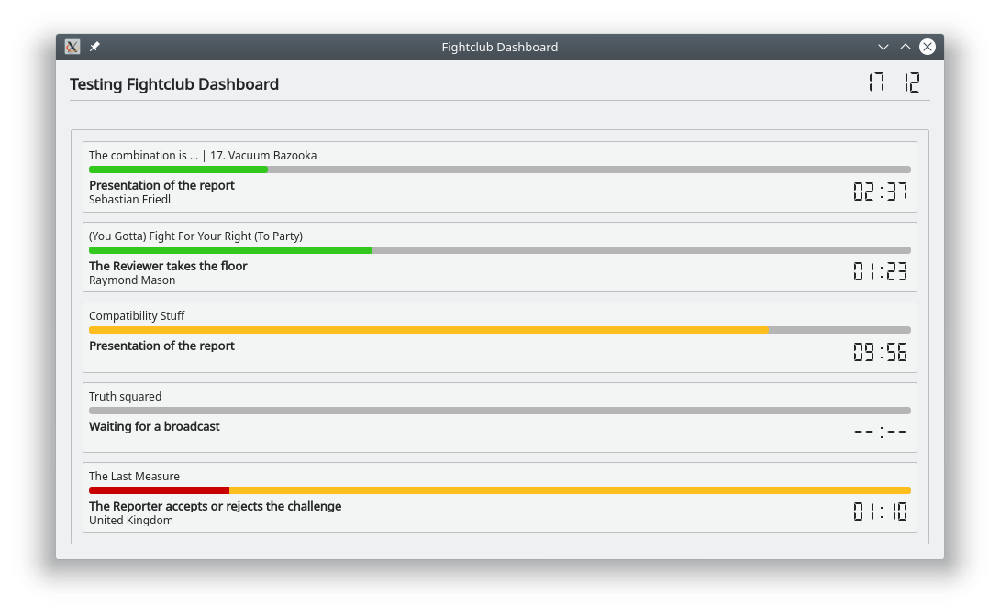

# Fightclub

**Current stable, distributed versions:**

 - Department 0.5
 - Teleprinter 0.9
 - Dashboard 0.2

### About Fightclub
Fightclub aims to become an enhanced clock system for the [International Young Physicist's Tournament (IYPT)](http://iypt.org).
Currently, heavy development is in progress, so design, workflow and requirements may change between two versions and result in incompatibilities.

Fightclub currently consists of the following components:

 - *Fightclub Department*, an application for timing a physics fight.
 - *Fightclub Teleprinter*, a remote clock window for use on remote machines inside the local network.
 - *Fightclub Dashboard*, displaying the state of multiple clients

Following components are considerd as “useful” and may be added soon:

 - *Fightclub Disperser*, a tool for duplicating broadcast signals emitted by Fightclub Department
 - *Fightclub Nano*, a clock window with an own timing engine, but not as powerful as *Fightclub Department*

 
### Installation
 - **Linux:** Users of Linux systems should compile Fightclub binaries from source. An [Installation script for Debian-based distributions](INSTALL.debian) is provided. Users of other distributions may refer to it, however, some minor modifications may be required.
 - **Windows:** For Windows, pre-compiled binaries are available in the [Releases section](https://github.com/SFr682k/fightclub/releases). Please note that the provided Windows binaries are not generated after a new release and therefore might be outdated.

### Notes on data files
Fightclub applications use plain text files for loading data. They can be created and edited using a common text editor.  
Please review the [requirements on these data files](docs/fightclub-file-requirements.pdf).

### Command Line Interface
Fightclub Teleprinter and Fightclub Dashboard provide a command line interface.  
Command line syntax and available options can be displayed by calling the respective application together with the `-h` or `--help` option.

### Common hotkeys
Most Fightclub applications support the following hotkeys:

 - `Ctrl + F` for entering fullscreen mode,
 - `Esc` for leaving fullscreen mode and closing dialogs,
 - `Ctrl + Shift + S` for opening the application’s settings,
 - `F1` for opening the “About” dialog and
 - `Ctrl + Q` for closing the application

### Screenshots
Fightclub Department is equipped with a clear, intuitive interface for managing the physics fight.  

During a physics fight, the embedded clock window displays elapsed time as well as the well-known “progress pie-chart.”  

For other points of order, the current time may be displayed.  

The state of multiple Fightclub Departments can be seen on the Fightclub Dashboard:  

### License
Fightclub applications are licensed under version 3 of the GNU General Public License.  
Please review the following information to ensure the GNU General Public License version 3.0 requirements will be met:
[http://www.gnu.org/copyleft/gpl.html](http://www.gnu.org/copyleft/gpl.html)

### Third party libraries
Fightclub applications use:

 - the [Qt](https://www.qt.io/) framework,
 - the [“Breeze” icon theme](https://github.com/kde/breeze-icons) and
 - some components of the [QIYPTClock](https://github.com/drogenlied/QIYPTClock)
