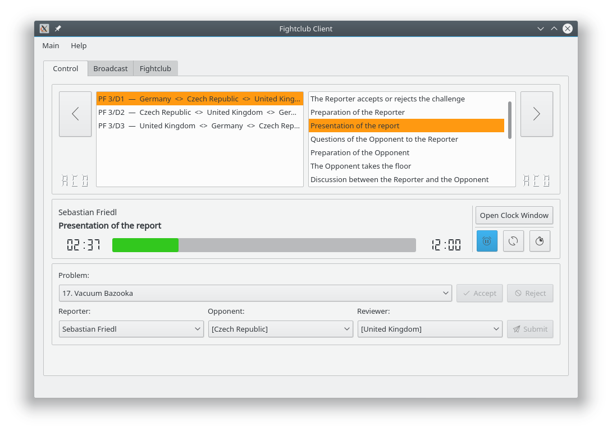

## Fightclub Client

### Screenshots
Fightclub Client is equipped with a clear, intuitive interface for managing the physics fight.  

During a physics fight, the embedded clock window displays elapsed time as well as the well-known “progress pie-chart.”  

For other points of order, the current time may be displayed.  

## Legal Notes
### License
Fightclub is licensed under version 3 of the GNU General Public License.  
Please review the following information to ensure the GNU General Public License version 3.0 requirements will be met:
[http://www.gnu.org/copyleft/gpl.html](http://www.gnu.org/copyleft/gpl.html)

### Third party libraries
Fightclub Client uses:

  - the Qt framework,
  - the “Breeze” icon theme and
  - some components of the [QIYPTClock](https://github.com/drogenlied/QIYPTClock)

The respective copyright holders are listed in the headers of the source files and in the application's “About” dialog.
  
